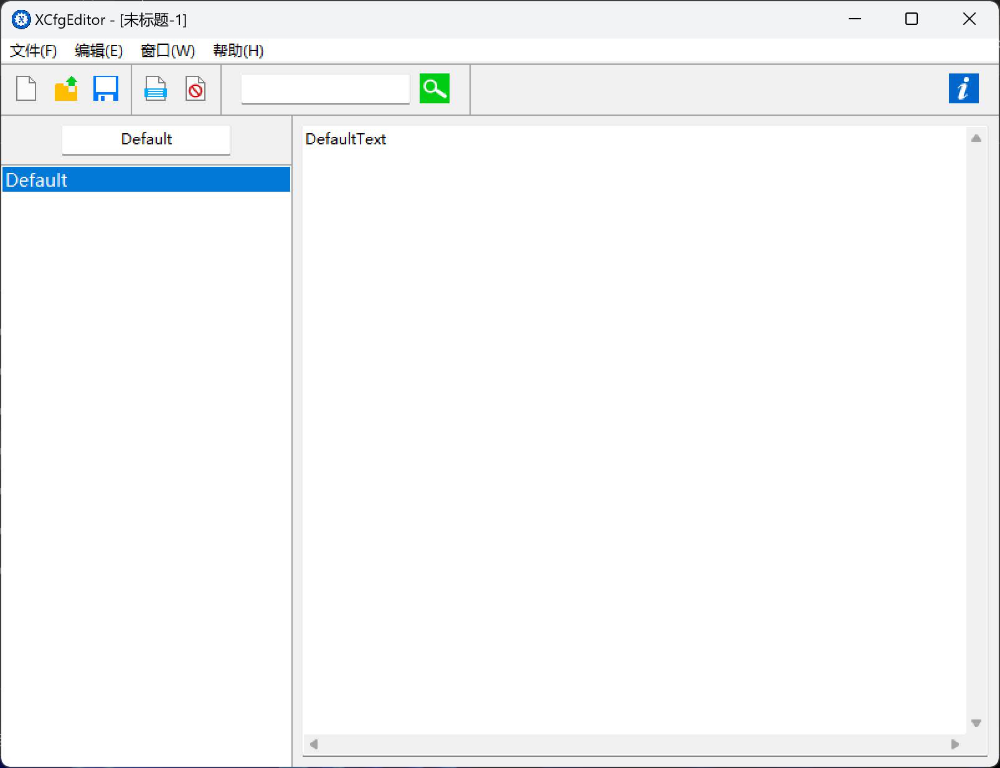

# XCfgEditor

Editor for XCfg files (a configuration file format created by MaxXing), completed in July 2014.

XCfg 格式的配置文件编辑器, 完成于 2014 年七月 (大概高一暑假).

XCfg 格式是我“自创”的一种格式, 本质上是 VB6 提供的 Property Bag 格式套壳 (当然我乐于承认此事, 并且即刻开源).

这种格式有什么优点呢? 好像……也没什么优点, Property Bag + 一些元数据而已, 详情可以参考 [`XCfgModule/modXCfg.bas`](XCfgModule/modXCfg.bas). 但我当时就开始热衷于造轮子了, 试图什么都用自己设计的一套, 于是就有了这个东西, 以及它的编辑器.



## 原始的 README, 来自 2014 年的 MaxXing

```
XCfgEditor v0.4.9
By MaxXSoft 曼软软件工作室
====================
此工具可以编辑符合 MaxXSoft XCfg 文件规范（版本：0）的文件。

当前版本的编辑器不具备自动更新功能，
若有需要请访问 MaxXSoft 软件页（http://MaxXSoft.net/Software/）下载最新版本。
```

## Copyright and License

Copyright (C) 2014 MaxXSoft (MaxXing). License GPLv3.
